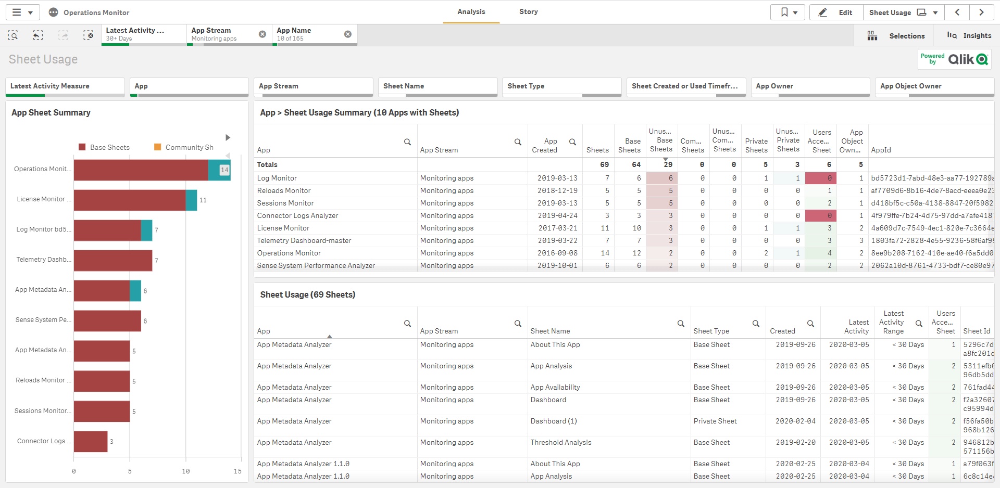
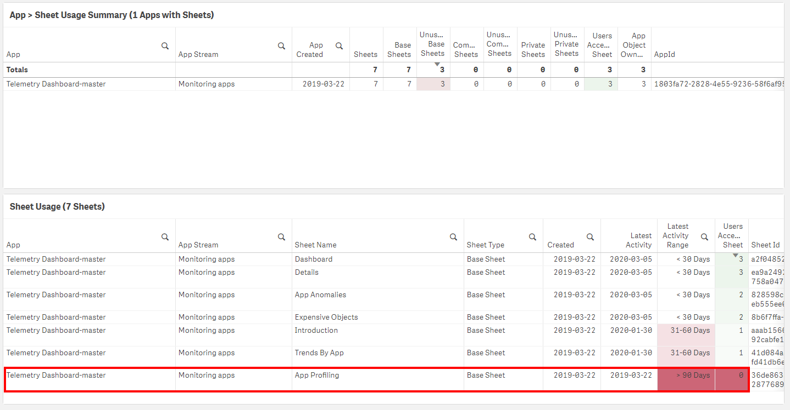
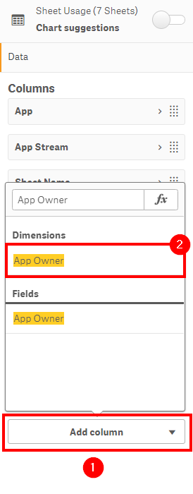
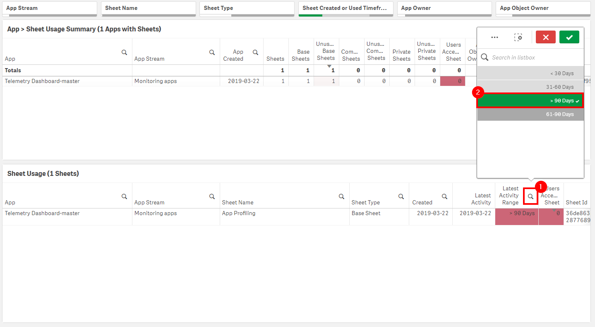

# Notification of Unused Base/Community Sheets <i class="fas fa-dolly-flatbed fa-xs" title="Shipped | Native Capability"></i><i class="fas fa-tools fa-xs" title="Tooling | Pre-Built Solutions"></i><i class="fas fa-file-code fa-xs" title="API | Requires Script"></i>

{:.no_toc}

## Applicable Environments
{:.no_toc}
- Production (w/ Self-Service Enabled)

## Goal
{:.no_toc}
There are three primary goals:
  - Remove (or consider modifying) "Base" sheets that are not being used. This will focus down your applications and remove clutter, while also increasing performance of the site.
  - Keep "Community" sheets under control. In large environments where self-service is enabled, both private (personal sheets on a published application), and community sheets can grow rapidly out of control -- especially if the application's base sheets doesn't offer what the end-user is looking for, causing them to create their own sheets.
  - Finding out "why" users are not using certain base sheets and/or why they are creating and publishing many community sheets, as that content could potentially be made part of the standardized application.

** Note that "Private" sheets should be handled a bit differently--please refer to: [Remove Unused Private Sheets](remove_private_unused_sheets.md)

## Table of Contents
{:.no_toc}

* TOC
{:toc}
-------------------------

## QMC - Audit Activity Log <i class="fas fa-dolly-flatbed fa-xs" title="Shipped | Native Capability"></i>

As of the **fill in release here** release, the **Audit Activity Log** capability is now enabled, which allows for the tracking of who is accessing what sheets in applications. This enables the ability to measure sheet adoption as well as manage the amount of sheets in the applications--keeping them trimmed to only what is being leveraged.

This logging must be enabled on _every engine_ that the information is desired from, and is turned on by default on supporting releases.

[](https://raw.githubusercontent.com/qs-admin-guide/qs-admin-guide/master/docs/asset_management/apps/images/notification_unused_sheets_native_1.png)

This usage information is then surfaced inside of the **Operations Monitor** on the **Sheet Usage** sheet.

[](https://raw.githubusercontent.com/qs-admin-guide/qs-admin-guide/master/docs/asset_management/apps/images/notification_unused_sheets_native_2.png)

As an example, we'll select the Telemetry Dashboard application on one of our rarely used internal servers, and we can see that the _App Profiling_ base sheet hasn't been accessed in, actually almost exactly one year.

[](https://raw.githubusercontent.com/qs-admin-guide/qs-admin-guide/master/docs/asset_management/apps/images/notification_unused_sheets_native_3.png)

It is suggested that the administrator would add the **App Owner** field to the **Sheet Usage** table, and then contact the owner's either manually or programmatically via something like NPrinting. It is suggested that it is the owner's responsibility to decide what to do with these unused sheets. Base sheets should be considered the most critical sheets to address, with community sheets following.

[](https://raw.githubusercontent.com/qs-admin-guide/qs-admin-guide/master/docs/asset_management/apps/images/notification_unused_sheets_native_4.png)

As far as the time range for sheets that are unused (or minimally used), it is suggested to select the _'> 90 days'_ value from the **Latest Activity Range** field -- though this range is ultimately up to the organization.

[](https://raw.githubusercontent.com/qs-admin-guide/qs-admin-guide/master/docs/asset_management/apps/images/notification_unused_sheets_native_5.png)

This process is typically customized by the organization, however these steps and high-level processes are the primary components to managing base and community sheets.

-------------------------

## Bulk Base/Community Sheet Removal <i class="fas fa-file-code fa-xs" title="API | Requires Script"></i>

The below script snippet requires the [Qlik CLI](../../tooling/qlik_cli.md).

**It is generally considered to always remove base and community sheets manually, leaving that responsibility to the owner of the applications. That being said, if there are potentially thousands of sheets that need to be removed, and this is the first time the organization is starting this management process, it is possible to programmatically remove these assets. This would generally be a one-time operation, as it is suggested to do this process monthly, which should be able to be maintained incrementally.**

The script below will tag any base or community sheets with the tag _'UnusedBaseOrCommunitySheet'_. It expects a csv file as an input, where the name of the column with the **Sheet Id** is specified.

### Script
```powershell

<insert awesome rad script here>
```

Once the script has been run above, and a review of the tagging has been confirmed as correct, the script below can be run to **permanently delete** these base/community sheets. **This process cannot be reversed.**

### Script
```powershell

<insert awesome rad script here>
```


**Tags**

#monthly
