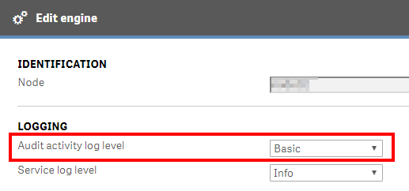
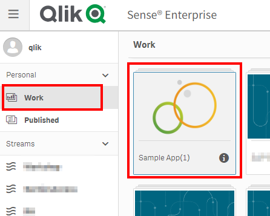
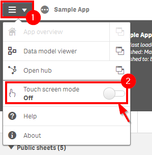
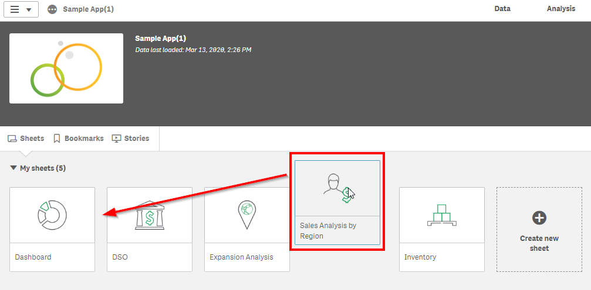
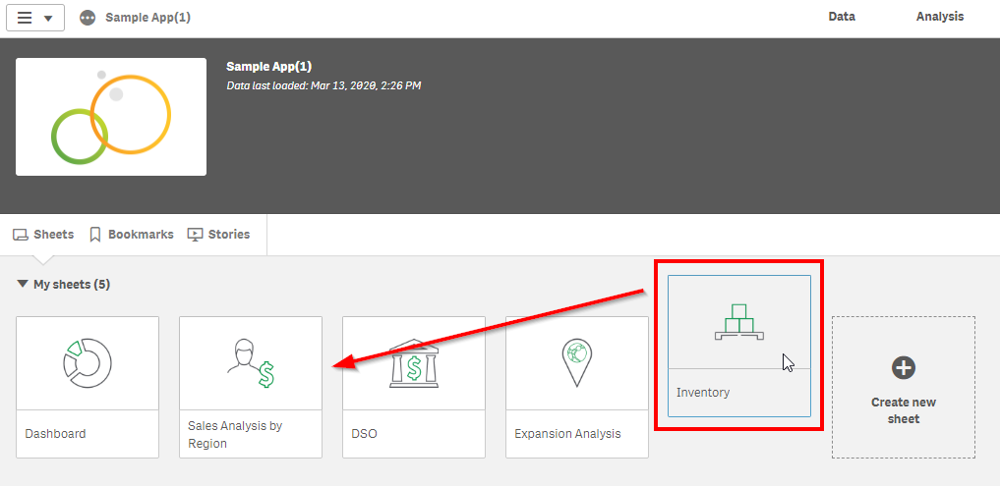
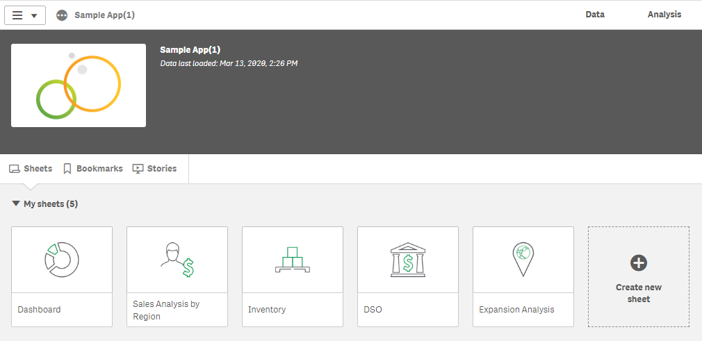
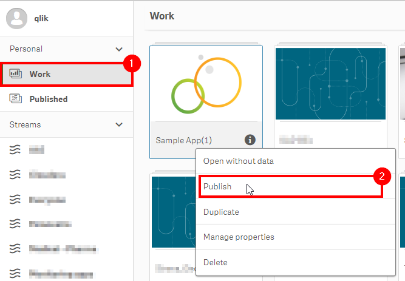
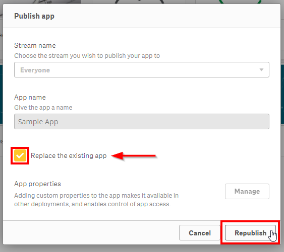

# Optimize Sheet Order for Adoption <i class="fas fa-dolly-flatbed fa-xs" title="Shipped | Native Capability"></i>
{:.no_toc}

production

|                                  		                    | Initial | Recurring |
|---------------------------------------------------------|---------|-----------|
| <i class="far fa-clock fa-sm"></i> **Estimated Time**   | 1 hr    | 15 min    |

Benefits:

  - Increase adoption
  - Improve focus
  
-------------------------

## Goal
{:.no_toc}

This page will help you, or the application owner, optimize the application sheet order using the sheet usage data. 

When an application is developed, the sheets are ordered in a logical flow (Ex: [DAR methodology](https://community.qlik.com/t5/Qlik-Design-Blog/DAR-methodology/ba-p/1466733), a methodology that was created for QlikView and it is also applicable for Qlik Sense). The sheet optimization should not overoptimize the flow. 

You must combine the usage data with the logical flow to make sure that the new sheet order will increase adoption rates and BI effectiveness.

This activity should be fractionalized and you can do this for just a few applications once a quarter, otherwise it could turn in to an exhaustive activity.

## Table of Contents
{:.no_toc}

* TOC
{:toc}

-------------------------

## Suggested Prerequisites

- [Notification of Unused Base/Community Sheets](notification_unused_sheets.md)

-------------------------

## Audit Activity Log <i class="fas fa-dolly-flatbed fa-xs" title="Shipped | Native Capability"></i>

As of the February 2019 release, the **Audit Activity Log** capability is now enabled, which allows for the tracking of who is accessing what sheets in applications. This enables the ability to measure sheet adoption as well as manage the amount of sheets in the applications--keeping them trimmed to only what is being leveraged.

This logging must be enabled on _every engine_ that the information is desired from, and is turned on by default on supporting releases.

-------------------------

## Operations Monitor - Select Applications with Higher or Lower Quantity of Sessions  <i class="fas fa-dolly-flatbed fa-xs" title="Shipped | Native Capability"></i>

Before we check the Sheets usage data, it is a good practice to select specific applications to analyze, we recommend you start with the 5 top applications with the higher (to improve more used applications) or lower (to improve applications adoption) quantity of sessions.

Open **Operations Monitor**, inside of **Monitoring Apps** stream:

Open **Session Details** sheet to have detailed information of applications with the higher or lower quantity of sessions:

In the **App Session Summary** table, you have all the applications with the related quantity of sessions. To reorder the table by the sessions, to the higher or lower quantity you should click in the **Sessions** column title (the gray arrow below the title will show if it is being ordered by ascending or descending order, to change between ascending to descending you just need to click again in the Sessions column title):

You can now select the applications that you want to analyze the sheet usage by clicking in the application names, in this example, I am selecting the top 5 applications:

-----------------------

## Operations Monitor - Analyze Aplication Sheet Adopion  <i class="fas fa-dolly-flatbed fa-xs" title="Shipped | Native Capability"></i>

After selecting some applications in the previous step, we should now get the sheets usage data to help us in the sheet optimization process.

The sheet usage data it is inside the **Sheet Usage** sheet.

You can now see the number of sheets (Base Sheets, Community Sheets, and Private Sheets) that we have in each application that we previously selected.

To make it an easier process we encourage you to select one application per time. In this example, I will start with the "Sample App".

With only one application selected, inside the **Sheet Usage** you will have the sheets usage data.

To reorder the table by the sheet usage, to the higher or lower quantity you should click in the **Users Accessing Sheets** column title (the gray arrow below the title will show if it is being ordered by ascending or descending order, to change between ascending to descending you just need to click again in the Users Accessing Sheet column title).

You can also export the **Users Accessing Sheets** table and share it with the application owner to optimize the sheets order.

> **Protip:**
> You can use Qlik NPrinting to distribute the Sheet Usage table to distribute sheet usage data to application owners.

> **Protip:**
> If you have Community Sheets with a higher quantity of sessions than base sheets, you can check what are the objects inside and potentially add them to a base sheet. You can also promote the community sheet to a Base Sheet after your performance check.

This process should be repeated for 5 selected applications that you previously selected, to return to the previous selection state and select another application, click in the previous selection button.

-------------------------

## Reorder Application Sheet

Before reordering the sheets we need to analyze the sheet's logical flow and combined with the sheets usage data that we got from the previous step.

In this example I will keep the Dashboard sheet as the first one, even not being the most accessed, to do not break the application logical flow, and move the Sales Analysis and Inventory.

To change the sheets order the application owner should clone the "Sample App".

As soon as the application gets duplicated the new application will be at the owner's Personal > Work area. Now the owner can edit the Base Sheets order.

As soon as the application is open, make sure that the "Touch screen mode" feature is turned off.

To move sheets we just need to drag and drop them to the desired order. In this case, I will make the "Sales Analysis by Region"  sheet the second one.

And the "Inventory" sheet the third sheet.

Now the application sheet order is optimized.

The "Sample App" now should be republished by the application owner.
The application owner needs to go to Personal > Work area and Publish the application that we changed the sheets order.

Make sure to check the **Replace the existing app** box to make sure you are replacing the previous version.

**Tags**

#quarterly
