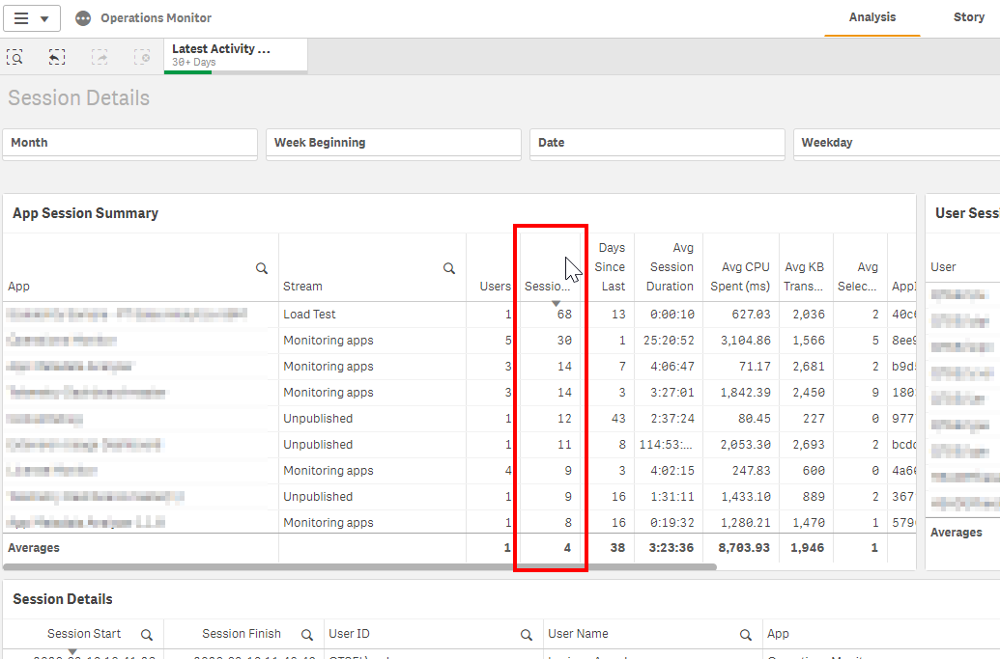
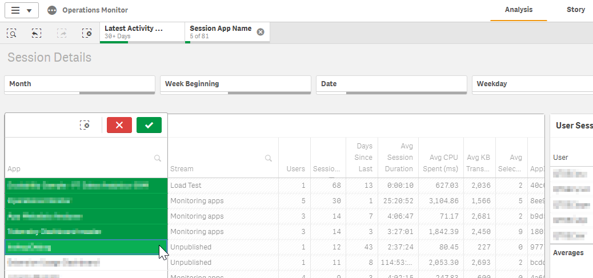
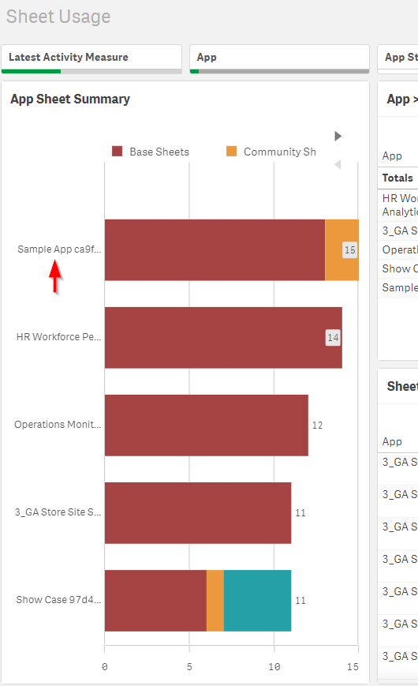
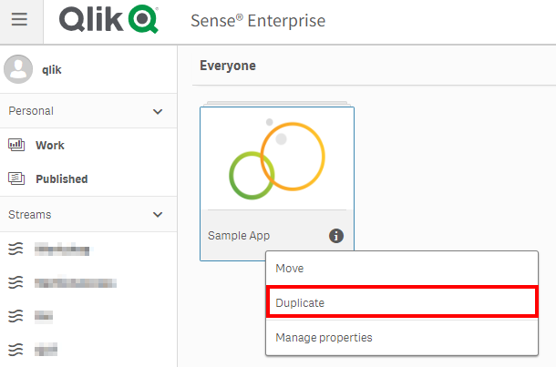

# Optimize Sheet Order for Adoption <i class="fas fa-dolly-flatbed fa-xs" title="Shipped | Native Capability"></i>
{:.no_toc}

## Applicable Environments
{:.no_toc}
* Production

## Goal
{:.no_toc}

When an application is developed, the sheets are ordered in a logical flow (Ex: DAR methodology); the sheet optimization should not overoptimize the flow. This page will help you or the application owner optimize the application sheet order using the sheet usage data, and you must combine the usage data with the logical flow to make sure that the new sheet order will increase adoption rates and BI effectiveness.

## Table of Contents
{:.no_toc}

* TOC
{:toc}

-------------------------

## Suggested Prerequisites

- [Notification of Unused Base/Community Sheets](notification_unused_sheets.md)

-------------------------

## Audit Activity Log <i class="fas fa-dolly-flatbed fa-xs" title="Shipped | Native Capability"></i>

As of the February 2019 release, the **Audit Activity Log** capability is now enabled, which allows for the tracking of who is accessing what sheets in applications. This enables the ability to measure sheet adoption as well as manage the amount of sheets in the applications--keeping them trimmed to only what is being leveraged.

This logging must be enabled on _every engine_ that the information is desired from, and is turned on by default on supporting releases.

-------------------------

## Operations Monitor - Analyze Aplication Sheet Adopion  <i class="fas fa-dolly-flatbed fa-xs" title="Shipped | Native Capability"></i>

It is possible to check the application's sheets usage using the Operations Monitor App.

In the Monitoring Apps stream, select **Operations Monitor**:

Inside the Operations Monitor application there is a dedicated sheet to do the sheet usage analysis:

Inside the **Sheet Usage** sheet you will be able to see all sheets across all the applications, as a recomendation:

  * Start selecting applications that have the highest quantity of sheets (using the **App Sheet Summary** bar chart)
  * Or Start with applications that have the highest or lower quantity of sessions (using the **App Sessoins Summary** table  in the **Session Overview** tab of this application).

For this example I will select an application named "Sample App" that it is the my application with the highest quantity of sheets:

<!--- Adjust the following screenshot --->

Now we can see all the sheets (Base Sheets, Community Sheets and Private Sheets) that I have inside the "Sample App" application.
> **Protip:**
> If you have Community Sheets with a higher quantity of access than base sheets you can check what are the objects inside and potentially add them to a base sheet, or promote the community sheet to a Base Sheet after your performance check.

<!--- Adjust the following screenshot --->

Now that you have access to the sheets usage data you or the application owner can reorder them to increase the application adoption rate. As mentioned before, please make sure that you are not overoptimizing the sheets order and it will not break the application logical flow

In this example I will keep the Dashboard sheet as the fist one, even not being the most accesed, to do not break the application logical flow, and move the Sales Analysis and Inventory.

You can also move sheets with a lower quantity of access to the front to increase their access.

> **Protip:**
>  You can use Qlik NPrinting to distribuite the Sheet Usage table to distribute sheet usage data to application owners.

-------------------------

## Reorder Application Sheet

If we open the published "Sample App" application we can see that the original order do not correspod with the usage.

To change that order by defaut the application owner should clone the "Sample App".

As soon as the application gets duplicated it will be at Personal > Work area. Now we can edit the Base Sheets order.

As soon as the application is open, make sure that the "Touch screen mode" feature is turned off.

To move sheets we just need to drag and drop them to the desired order. In this case I will make sheet "Sales Analytis by Region" the second sheet.

And the "Inventory" sheet the third sheet.

Now the application sheet order is compliant with the usage data.

The "Sample App" now should be republished, replacing the old version.

**Tags**

#quarterly
