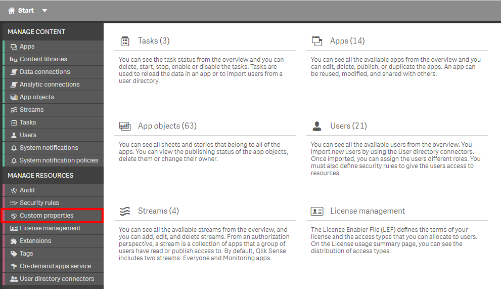
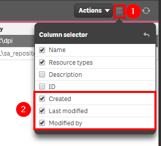
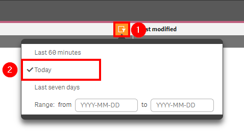
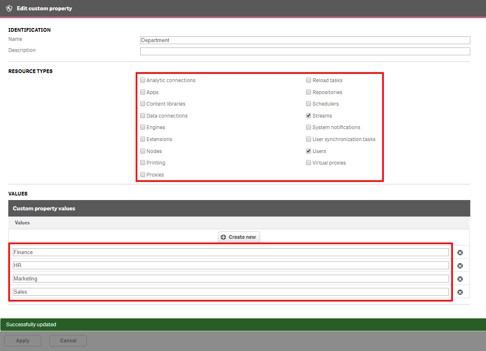
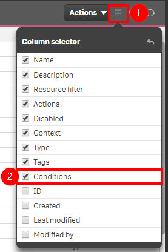
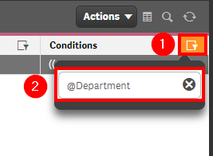
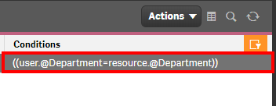

# Check for New/Modified Custom Properties <i class="fas fa-dolly-flatbed fa-xs" title="Shipped | Native Capability"></i> <i class="fas fa-file-code fa-xs" title="API | Requires Script"></i>
{:.no_toc}

## Applicable Environments
{:.no_toc}
- All

## Goal
{:.no_toc}
Regularly checking for new/modified custom properties allows you to track what/how users are controlling security and management across your Qlik environment.

Some of the goals:
  - Discover new custom properties so that their usage can be identified (e.g. through contacting the creator)
  - Identify modified custom properties so that their expanded usage can be identified and tracked
  - Regulate the amount of custom property value options, as there can be performance impacts if there are many
  - Identify whether individual custom properties are being leveraged for security rules or for management/automation purposes

## Table of Contents
{:.no_toc}

* TOC
{:toc}
-------------------------

## QMC - Custom Properties <i class="fas fa-dolly-flatbed fa-xs" title="Shipped | Native Capability"></i>

In the QMC, select **Custom Properties**:

[](https://raw.githubusercontent.com/qs-admin-guide/qs-admin-guide/master/docs/asset_management/apps/images/check_new_custom_properties_native_1.png)

In the upper right hand side of the screen, select the **Column selector**, and then select the **Created**, **Last modified**, and **Modified by** columns.

[](https://raw.githubusercontent.com/qs-admin-guide/qs-admin-guide/master/docs/asset_management/apps/images/check_new_custom_properties_native_2.png)

Now select the filter icon for the **Created** column, and then select the filter of **Today** (or **Last seven days** if you'd like a slightly larger rolling window).

[](https://raw.githubusercontent.com/qs-admin-guide/qs-admin-guide/master/docs/asset_management/apps/images/check_new_custom_properties_native_3.png)

Take the time to review the results and potentially reach out to their creators if they are brand new custom properties. Ensure that the same steps above are followed to filter on **Last modified** as well.

Next, it is encouraged to select the custom property and view its values and its applicable resources.

[](https://raw.githubusercontent.com/qs-admin-guide/qs-admin-guide/master/docs/asset_management/apps/images/check_new_custom_properties_native_4.png)

Lastly, it is simple to check if the custom property is being used in any security rules. Navigate to the **Security Rules** section in the QMC.

[](https://raw.githubusercontent.com/qs-admin-guide/qs-admin-guide/master/docs/asset_management/apps/images/check_new_custom_properties_native_sec.png)

In the upper right hand side of the screen, select the **Column selector**, and then select the **Conditions** column.

[](https://raw.githubusercontent.com/qs-admin-guide/qs-admin-guide/master/docs/asset_management/apps/images/check_new_custom_properties_native_5.png)

Now select the filter icon for the **Conditions** column, and then enter the name of the custom property, prepended by the **@** symbol, which denotes the use of a custom property in a security rule, e.g. _@Department_.

[](https://raw.githubusercontent.com/qs-admin-guide/qs-admin-guide/master/docs/asset_management/apps/images/check_new_custom_properties_native_6.png)

If any security rules are using this rule, they will be visible, and you can then explore the rule and confirm whether it is enabled or disabled.

[](https://raw.githubusercontent.com/qs-admin-guide/qs-admin-guide/master/docs/asset_management/apps/images/check_new_custom_properties_native_7.png)

-------------------------

## Get List of New/Modified Custom Properties (Qlik CLI) <i class="fas fa-file-code fa-xs" title="API | Requires Script"></i>

The below script snippet requires the [Qlik CLI](../../tooling/qlik_cli.md).

The script will bring back any custom properties that have been created or modified within the las x days. The script will then store the output into the location of your choice in either csv or json format.

### Script
```powershell
# Function to collect custom properties that were created or modified within the last x days

# Parameters
# Assumes default credentials are used for the Qlik CLI Connection
$computerName = 'machineName'
$virtualProxyPrefix = '/default' # leave empty if windows auth is on default VP
$daysBack = 1
$filePath = 'C:\'
$fileName = 'output'
$outputFormat = 'json' # can be 'json' or 'csv'

$outFile = ($filePath + $fileName + '.' + $outputFormat)
$date = (Get-Date -date $(Get-Date).AddDays(-$daysBack) -UFormat '+%Y-%m-%dT%H:%M:%S.000Z').ToString()
$computerNameFull = ($computerName + $virtualProxyPrefix).ToString()

# Main
Connect-Qlik -ComputerName $computerNameFull -UseDefaultCredentials -TrustAllCerts

If ($outputFormat.ToLower() -eq 'csv') {
  Get-QlikReloadTask -filter "createdDate ge '$date'" -full | ConvertTo-Csv -NoTypeInformation | Set-Content $outFile
  }  Else {
  Get-QlikReloadTask -filter "createdDate ge '$date'" -full | ConvertTo-Json | Set-Content $outFile
}
```

### Example Output
```
{
    "id":  "776ac36a-084b-4d1b-989a-877c83d22efb",
    "createdDate":  "2020/03/04 03:20",
    "modifiedDate":  "2020/03/04 03:31",
    "modifiedByUserName":  "QLIK-POC\\dpi",
    "name":  "Department",
    "valueType":  "Text",
    "choiceValues":  [
                         "HR",
                         "Finance",
                         "Marketing",
                         "Sales"
                     ],
    "objectTypes":  [
                        "Stream",
                        "User"
                    ],
    "description":  "",
    "privileges":  null,
    "schemaPath":  "CustomPropertyDefinition"
}
```

**Tags**

#weekly
