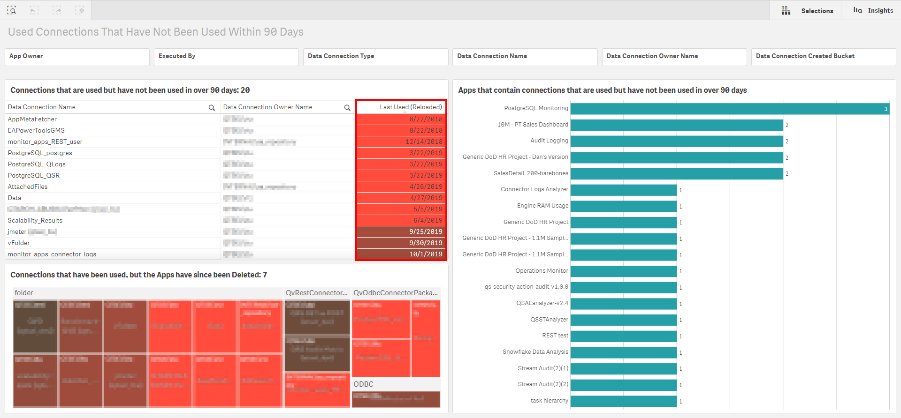
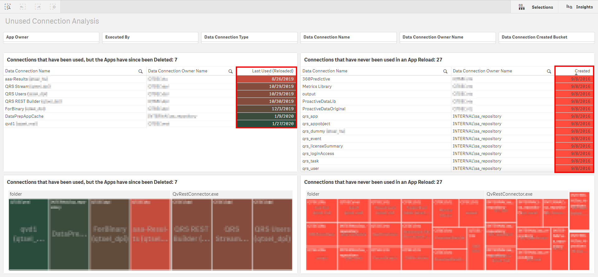

# Remove Unused Data Connections
Stuff stuff stuff.

# Remove Unused Data Connections <i class="fas fa-dolly-flatbed fa-xs" title="Shipped | Native Capability"></i> <i class="fas fa-tools fa-xs" title="Tooling | Pre-Built Solutions"></i> <i class="fas fa-file-code fa-xs" title="API | Requires Script"></i>
{:.no_toc}

## Applicable Environments
{:.no_toc}
- Development
- Production

## Goal
{:.no_toc}
Removing unused connections on a regular basis decreases clutter, improves performance, and creates a better user experience. The goal of this section is to leave only the data connections that are necessary for analysis.

## Table of Contents
{:.no_toc}

* TOC
{:toc}
-------------------------

## Data Connection Usage

Data connections are a bit of a difficult entity to map to associated resources, as they are not directly mapped in the QRS to the apps that are using them. Data connections are evaluated in the script, and leveraged at the time of reload. 

There are two primary options for mapping data connections:
- The `lineage` endpoint of an application
  - Accessible via the [Qlik Engine REST API](https://help.qlik.com/en-US/sense-developer/February2020/APIs/QIXAPI/index.html?page=8) lineage endpoint, available as of the June 2019 release
  - Accessible via the [Qlik Engine API](https://help.qlik.com/en-US/sense-developer/February2020/Subsystems/EngineAPI/Content/Sense_EngineAPI/introducing-engine-API.htm)
- Parsing of evaluated script logs, as demonstrated by the [Data Connection Analyzer](../../tooling/data_connection_analyzer.md)

Pros and cons of the `lineage` option:

| Pros                                                                | Cons                                                                                                                                                                                    |
|---------------------------------------------------------------------|-----------------------------------------------------------------------------------------------------------------------------------------------------------------------------------------|
| Simple to iterate over (the RESTful option) from a Qlik load script | Returns fully evaluated folder paths, so that they cannot be properly mapped back to their respective lib:// connections--ultimately not allowing the mapping of any Folder connections |
| Quick and efficient                                                 | Can be difficult to parse the result                                                                                                                                                    |
| Includes INLINE and AUTOGENERATE loads                              | Does not include any history -- only most recent reload                                                                                                                                 |
|                                                                     | Does not offer insight what user used them when                                                                                                                                         |
|                                                                     | Does not offer insight into how many times they were used                                                                                                                               |
|                                                                     |                                                                                                                                                                                         |
|                                                                     |                                                                                                                                                                                         |
|                                                                     |                                                                                                                                                                                         |
|                                                                     |                                                                                                                                                                                         |

Pros and cons of the [Data Connection Analyzer](../../tooling/data_connection_analyzer.md) option:

| Pros                                                                           | Cons                                                                                           |
|--------------------------------------------------------------------------------|------------------------------------------------------------------------------------------------|
| Robust logic to handle all data connection types, including Folder connections | Can take many hours to run the first time, as it can parse thousands of logs                   |
| Has the ability to capture logs from all time                                  | Can potentially produce false positives for unused data connections (see app docs for details) |
| Can be used for comprehensive audit                                            |                                                                                                |
| Tracks what users used what connections when                                   |                                                                                                |
| Tracks how many time data connections have been run                            |                                                                                                |
| Tracks the source of the reload: Hub, Scheduler, or ODAG (api)                 |                                                                                                |
|                                                                                |                                                                                                |
|                                                                                |                                                                                                |
|                                                                                |                                                                                                |

-------------------------

## Unused Data Connections <i class="fas fa-tools fa-xs" title="Tooling | Pre-Built Solutions"></i>

To capture unused data connections, either of the two options from the **Data Connection Usage** section above may be employeed. _If using the `lineage` option, the resulting connections will need to be mapped back to the existing connections in the QRS. Please note the issue with that endpoint and Folder type connections, documented above._

In this section, we will use the [Data Connection Analyzer](../../tooling/data_connection_analyzer.md).

There are two sheets that should be focused on within that application:
- _Used Connections That Have Not Been Used Within 90 Days_
  - This sheet illustrates connections that were at one point active, but sometime over the last 90 days, they have fallen inactive--meaning, there are currently no applications that leverage them. This variable is configurable in the load script, and should be set according to corporate policy.
  `SET vNumDaysForUsedDataConnectionToBeConsideredUnused = 90;`
  
[](https://raw.githubusercontent.com/qs-admin-guide/qs-admin-guide/master/docs/asset_management/data_connections/images/unused_data_connections_native_1.png)

- _Unused Connection Analysis_
  - This sheet shows connections that have been used, by the only apps that ever used them have been deleted, as well as connections that have never been used.

[](https://raw.githubusercontent.com/qs-admin-guide/qs-admin-guide/master/docs/asset_management/data_connections/images/unused_data_connections_native_2.png)

-------------------------

## Suggested Actions

It is suggested that data connections be deleted _manually_, and that all data connections are validated for usage by the owner before deletion. The Data Connection Analyzer is largely accurate, but should not be treated as 100% so--validation must be done with the users. 

It would be adviseable to create a custom property such as _DataConnectionUnused_ and add it to any data connections that are to be considered for removal. With that custom property, security rules can then be leveraged to only grant read access to data connections _without that tag_. This will ensure that if a connection _was_ in fact used, it can be "re-enabled" by simply removing the custom property value from the connection. Potentially consider this type of disabling for up to a month prior to removal, as an extra pre-caution on top of the validation procedure.

### Priority

1. Connections that have never been used, especially connections that were not created recently. Recently created connections that have never been used simply may not have been used yet--so those should not be removed. Otherwise, these connections are purely clutter, that more than likely were once used for testing connectivity.

2. Connections that were used by applications where the applications have now been deleted. These are more than likely deprecated data sources.

3. Used data connections that haven't been used in "x" days. 

### Data Connection Backup

It might not be the worst idea to take a snapshot of all data connections before removal, in case one needs to be recreated. Data connections are not typically difficult to configure, but it is nice to have to reference in case.

-------------------------

### Script to Delete Data Connections

**It is highly recommended to delete data connections manually, after validating with their respective owners. That being said, that might not always be possible. Please refer to the _Suggestions_ section above.**

```powershell

<insert awesome rad script here to backup all data connections>
```

```powershell

<insert awesome rad script here to tag data connections from csv>
```

```powershell

<insert awesome rad script here to remove all tagged data connections>
```
