# Review Pinning/Load Balancing <i class="fas fa-dolly-flatbed fa-xs" title="Shipped | Native Capability"></i> <i class="fas fa-tools fa-xs" title="Tooling | Pre-Built Solutions"></i>
{: .no_toc }

production

|                                  		                    | Initial | Recurring |
|---------------------------------------------------------|---------|-----------|
| <i class="far fa-clock fa-sm"></i> **Estimated Time**   | 20 Min  | 5 min     |

Benefits:

  - Increase performance
  - Segregation/isolation of resources

## Goal
{:.no_toc}

The goal of this activity is to review the distribution of apps in an enviroment and implement load balancing or "pinning" if needed. Scenarios where customized load balancing inside of Qlik Sense Enterprise may be warranted include:

1. Segregation of Published apps from unpublished apps (aka a dedicated ad-hoc development node or nodes)
2. Segregation of larger applications to a dedicated node or nodes
3. Segregation of a specific line of business's apps to a dedicated node or nodes (e.g. isolating the apps in streams for the Sales group to a specific node)

By reading through the exercise on this page, the Qlik administrator is expected to have an understanding of how to leverage this capability and implement as the organization requires. 

The output of the [Capacity Plan](../system_planning/review_update_capacity_plan.md) should be a good indicator if this capability is necessary.

This guide will cover two specific scenarios (2 and 3) from above and link to coverage of scenario 1 so that the administrator has a template of a few options should they need to implement customized load balancing for their Qlik site.

## Table of Contents
{:.no_toc}

* TOC
{:toc}

-------------------------

## What is Load Balancing in Qlik Sense Enterprise?

Inside of Qlik Sense Enterprise there is a feature which allows for the administrator to customize the distribution of **apps** in their site across Qlik **Engines**. This feature uses Load Balancing Rules to define the conditions under which Qlik apps should be available on a Qlik Engine. The net effect of this feature is that the administrator has the capability to isolate or segregate Qlik apps based on the needs of their site. An example of this can be illustrated like so:

[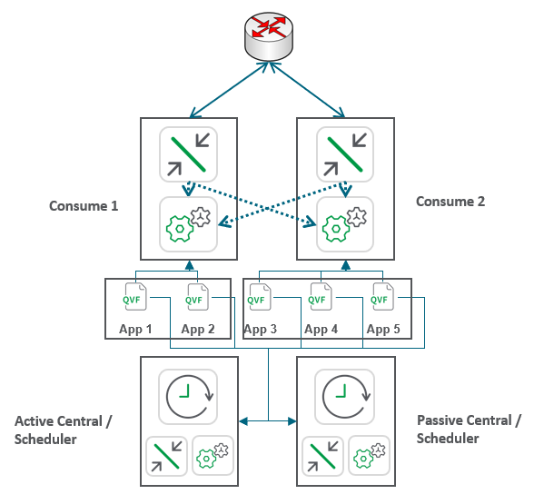](https://raw.githubusercontent.com/qs-admin-guide/qs-admin-guide/master/docs/asset_management/images/load_balancing-1.png)

In this example the administrator has pinned apps 1 & 2 to the Consume 1 node and apps 3-5 on the Consume 2 node. Apps 1-5 are likewise available to both back-end scheduler nodes.

While the scenarios which will be covered in this guide will focus on isolation of apps from the vantage of end users, the same principles can be applied to reload tasks. When a task is started, any node which has a Scheduler and Engine which has an app load balanced to it is eligable to execute this reload. 

* **Note**: Qlik Sense Enterprise has a default and unmodifiable rule named `ResourcesOnCentralNode` which means that the Central node will need to have all Qlik apps available on it. This rule cannot be modified due to architectural assumptions in the design of Qlik Sense Enterprise. For example, that apps which need to be migrated will be migrated by the Central node's Engine. Practically this means that when configuring load balancing rules, the Central node's Engine cannot be configured as a Load Balancing Engine for any Virtual Proxy. Otherwise applications will be opened by the Central node's Engine.

## Scenario 1 - Isolation of Production from Development

In this scenario the administrator wishes to create an ad-hoc development node which only hosts unpublished Qlik apps separate from a production node which hosts published Qlik apps. Refer to [this document](https://community.qlik.com/t5/Qlik-Sense-Documents-Videos/Using-Rules-to-segregate-Consumption-from-Development/ta-p/1687033) on Qlik Community for guidance on this scenario.

## Scenario 2 - Segregation of Larger Qlik Apps

In this scenario, the Qlik administrator is intending to isolate specific, larger Qlik apps to a dedicated node in the cluster. This scenario can be ideal in situations where a site hosts a few, select large Qlik apps with the remaining apps in the site's portfolio being of modest size. This isolation allows the site to not attempt to evenly distribute the load for these select apps which will cause duplicative RAM use across the nodes in the cluster. Duplication for smaller apps may be ideal for resiliency purposes but the site may not have the compute capacity to have resiliency for these larger Qlik apps or the administrator would like to ensure a more predictable user experience by re-using the cache on a single Engine.

The [App Metadata Analyzer](../tooling/app_metadata_analyzer.md) can be helpful in determing whether there are abnormally large apps in your Qlik Sense site.

### Configuration Walk-Through:

* Create the custom property **NodeType** for apps and nodes with the value option of `Dedicated`.

[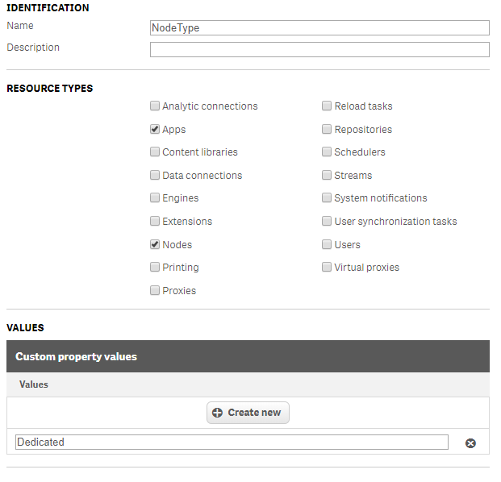](https://raw.githubusercontent.com/qs-admin-guide/qs-admin-guide/master/docs/asset_management/images/load_balancing-2.png)

* Apply the `Dedicated` value to the node which host the large Qlik apps.

[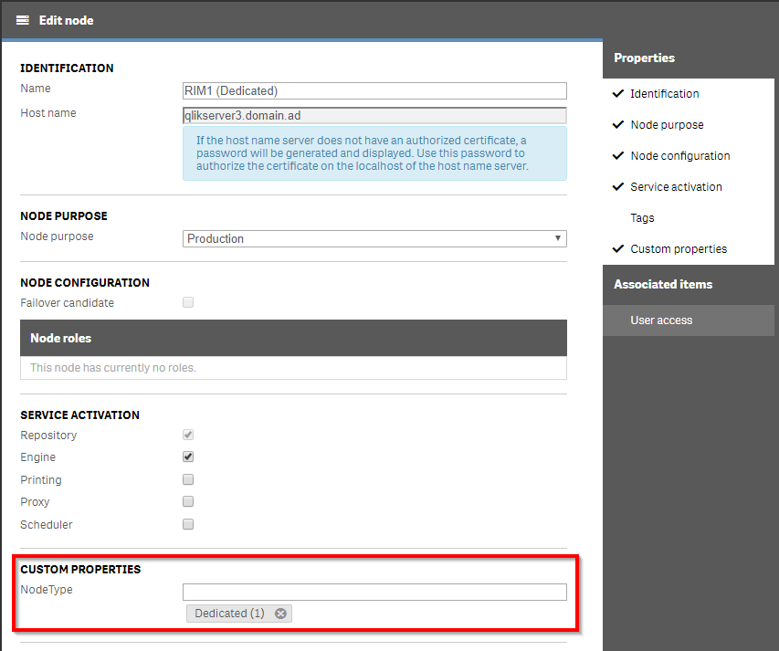](https://raw.githubusercontent.com/qs-admin-guide/qs-admin-guide/master/docs/asset_management/images/load_balancing-3.png)

* Apply the `Dedicated` value to the large Qlik app(s) which will be isolated. Repeat this process for all apps which are to be isolated.

[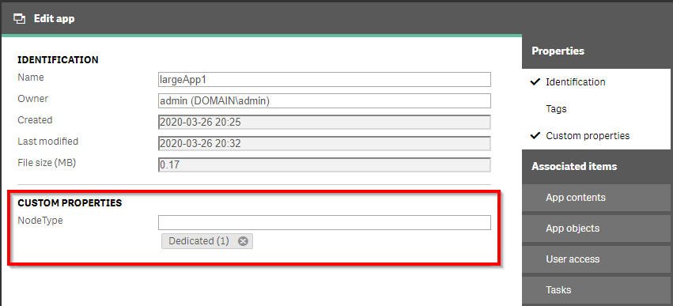](https://raw.githubusercontent.com/qs-admin-guide/qs-admin-guide/master/docs/asset_management/images/load_balancing-4.png)

**Hint**: The Column Selector can enable **NodeType** custom property in the apps section of the QMC to be able to filter on all the apps with the `Dedicated` custom property value assigned.

* In the **Load balancing rules** section of the QMC, disable the default rule `ResourcesOnNonCentralNodes`. This default rule load balances all apps which are not in the Monitoring Apps stream to all RIM nodes. If you have other customized load balancing rules which are enabled consider disabling those if they are not integral to your Qlik site.

* Create a new Load balancing rule with the following values:
  * **Name**: Dedicated Apps to Dedicated Node
  * **Description**: Apps with the NodeType custom property value of Dedicated will be isolated to the node which has the Dedicated custom property value. All non-"Dedicated" apps will available on remaining RIM nodes.
  * **Resource Filter**: `App_*`
  * **Actions**: Load balancing
  * **Conditions**: `((node.@NodeType=resource.@NodeType) or (node.@NodeType.Empty() and resource.@NodeType.Empty()))`
  * **Context**: Both in hub and QMC
* A Preview will display the effect of the load balancing rule. **Note** It may be helpful to select the Transpose button to view the resulting preview in a more consumable format.

[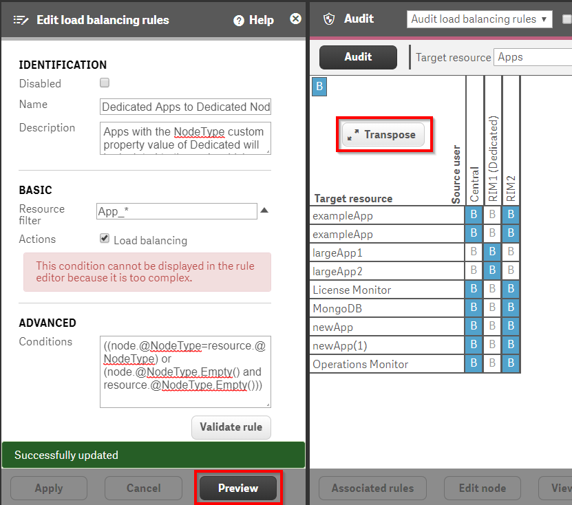](https://raw.githubusercontent.com/qs-admin-guide/qs-admin-guide/master/docs/asset_management/images/load_balancing-6.png)

### Validation:

* Ensure that the Virtual Proxy that will be used by the end users includes both the "Dedicated" node(s) as well as the non-dedicated node(s).

[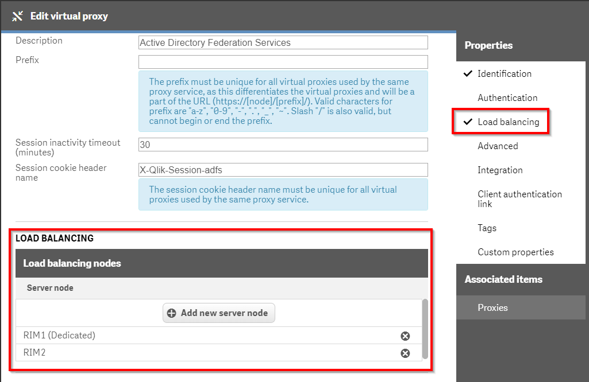](https://raw.githubusercontent.com/qs-admin-guide/qs-admin-guide/master/docs/asset_management/images/load_balancing-7.png)

* As a user who would be expected to see one of the apps which have been pinned to the Dedicated Node(s), open the Hub.

[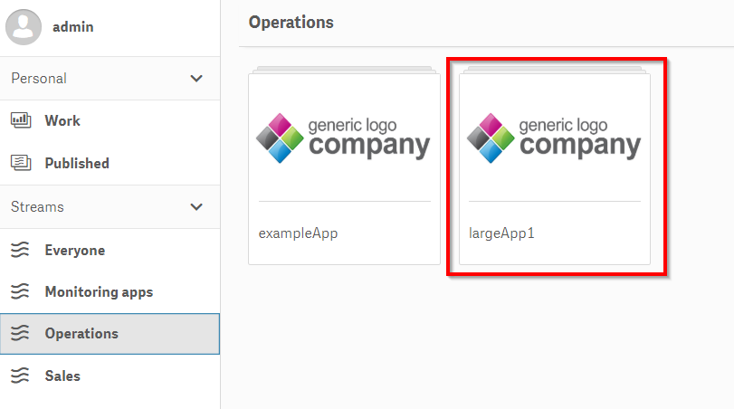](https://raw.githubusercontent.com/qs-admin-guide/qs-admin-guide/master/docs/asset_management/images/load_balancing-8.png)

* Open the app:
  * Create a new sheet
  * Add a KPI Visualization Object with the Measure of `=ComputerName()` which is used to display the Engine which is opening the Qlik app

[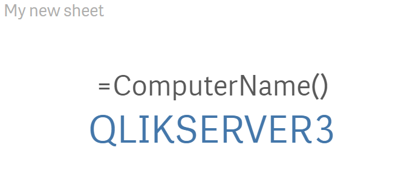](https://raw.githubusercontent.com/qs-admin-guide/qs-admin-guide/master/docs/asset_management/images/load_balancing-9.png)

## Scenario 2 - Segregation of apps by line of business (streams)

In the previous scenario, the Qlik administrator isolated specific Qlik apps to a dedicated node in a cluster. For this scenario the Qlik administrator will isolate all apps in specific streams to specific nodes. This use case makes sense when a Qlik site is servicing multiple tenants or departments and the adminstrator wants to isolate the consumption of Qlik apps by those departments / tenants. This scenario will use a custom property at the _stream_ layer rather than at the _app_ layer.

### Configuration Walk-Through:

* Create the custom property **StreamLevelNode** for streams and nodes with the value options of `Operations` & `Sales`.

[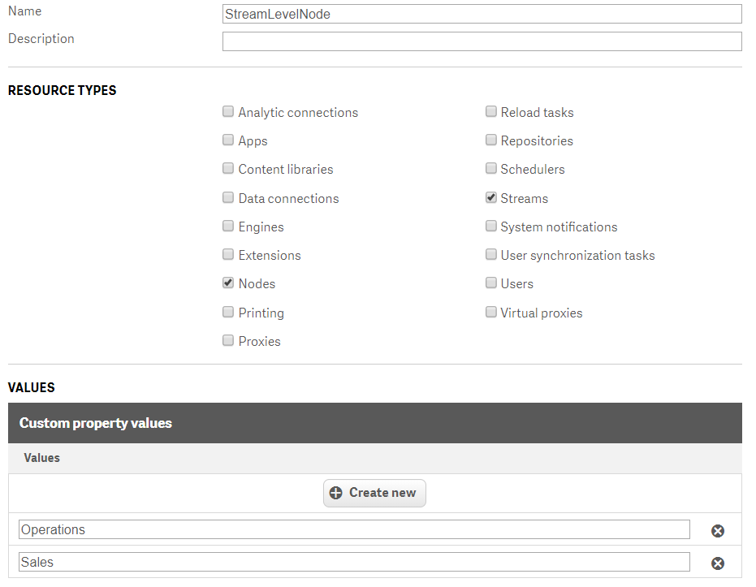](https://raw.githubusercontent.com/qs-admin-guide/qs-admin-guide/master/docs/asset_management/images/load_balancing-10.png)

* Apply the `Operations` value to the node which will host that group's apps. Do the same for the `Sales` value.

* Apply the `Operations` value to the Operations stream and `Sales` to the Sales stream.

* In the **Load balancing rules** section of the QMC, disable the default rule `ResourcesOnNonCentralNodes`. This default rule load balances all apps which are not in the Monitoring Apps stream to all RIM nodes. If you have other customized load balancing rules which are enabled consider disabling those if they are not integral to your Qlik site.

* Create a new Load balancing rule with the following values:
  * **Name**: Dedicated Apps to Dedicated Node
  * **Description**: Apps who are members of streams with a given StreamLevelNode custom property value will be load balanced to nodes with that same custom property value.
  * **Resource Filter**: `App_*`
  * **Actions**: Load balancing
  * **Conditions**: `((node.@StreamLevelNode=resource.stream.@StreamLevelNode) or (node.@StreamLevelNode.Empty() and resource.@StreamLevelNode.Empty()))`
  * **Context**: Both in hub and QMC
* A Preview will display the effect of the load balancing rule. **Note** It may be helpful to select the Transpose button to view the resulting preview in a more consumable format.

[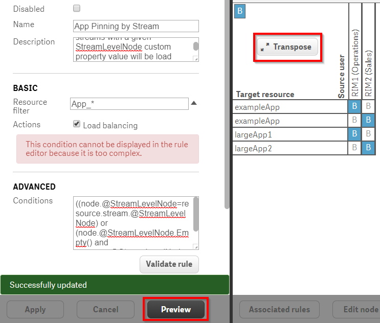](https://raw.githubusercontent.com/qs-admin-guide/qs-admin-guide/master/docs/asset_management/images/load_balancing-13.png)

### Validation:

* Ensure that the Virtual Proxy that will be used by the end users includes all RIM nodes. **Note** In this example we are only load balancing across the two RIM nodes. In your environment, the administrator will likely want to include at least one additional Engine in order to ensure availability of apps which are not members of the streams which have been isolated.

[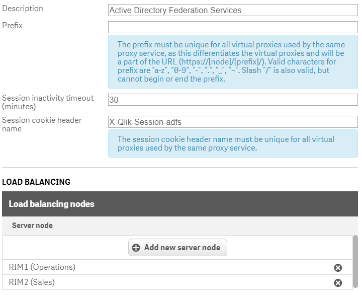](https://raw.githubusercontent.com/qs-admin-guide/qs-admin-guide/master/docs/asset_management/images/load_balancing-14.png)

* As a user who would be expected to see one of the streams who apps are pinned to an isolated node, Open the Hub.

[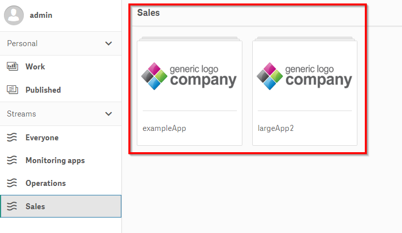](https://raw.githubusercontent.com/qs-admin-guide/qs-admin-guide/master/docs/asset_management/images/load_balancing-15.png)

* Open the app:
  * Create a new sheet
  * Add a KPI Visualization Object with the Measure of `=ComputerName()` which is used to display the Engine which is opening the Qlik app

[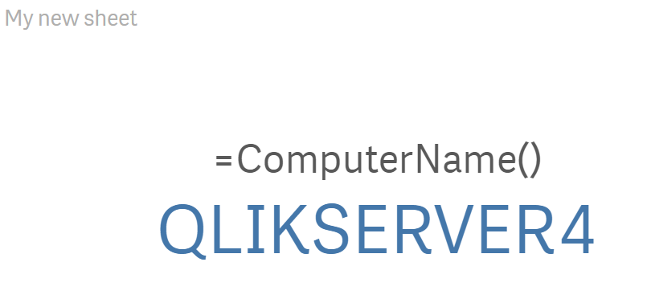](https://raw.githubusercontent.com/qs-admin-guide/qs-admin-guide/master/docs/asset_management/images/load_balancing-16.png)

**Tags**

#monthly

