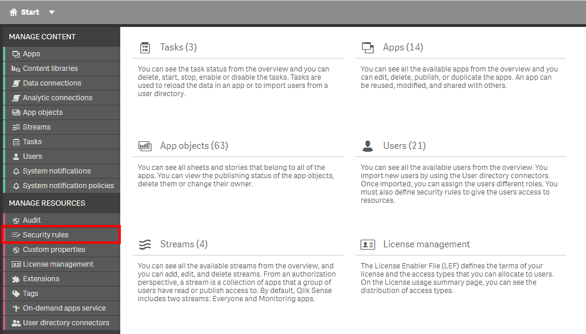
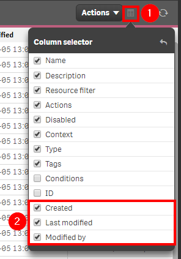
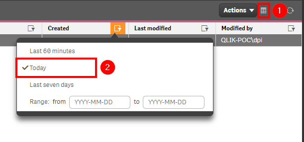

# Check for New/Modified Security Rules <i class="fas fa-dolly-flatbed fa-xs" title="Shipped | Native Capability"></i> <i class="fas fa-file-code fa-xs" title="API | Requires Script"></i>
{:.no_toc}

## Applicable Environments
{:.no_toc}
- All

## Goal
{:.no_toc}
Ensuring that security rules are tightly managed and governed is arguably the most important aspect of managing a Qlik site from an administrator's perspective. This area is critical to ensuring the right people have access to the appropriate resources, and have the appropriate privileges to act on those resources. It is important to see if new rules are being created, and it is also very important to check rules that have recently been modified. This section will cover both.

## Table of Contents
{:.no_toc}

* TOC
{:toc}
-------------------------

## QMC - Security Rules <i class="fas fa-dolly-flatbed fa-xs" title="Shipped | Native Capability"></i>

In the QMC, select **Security Rules**:

[](https://raw.githubusercontent.com/qs-admin-guide/qs-admin-guide/master/docs/asset_management/security_rules/images/check_new_rules_native_1.png)

In the upper right hand side of the screen, select the **Column selector**, and then select the **Created**, **Last Modified**, and **Modified by** columns.

[](https://raw.githubusercontent.com/qs-admin-guide/qs-admin-guide/master/docs/asset_management/security_rules/images/check_new_rules_native_2.png)

Now select the filter icon for the **Created** column, and then select the filter of **Today** (or **Last seven days** if you'd like a slightly larger rolling window).

[](https://raw.githubusercontent.com/qs-admin-guide/qs-admin-guide/master/docs/asset_management/security_rules/images/check_new_rules_native_3.png)

Lastly, you can review the resulting table and view any new streams. You will want to repeat this process for the **Last modified** column, reviewing what security rules were modified and by whom.

-------------------------

## Get List of New/Modified Security Rules (Qlik CLI) <i class="fas fa-file-code fa-xs" title="API | Requires Script"></i>

The below script snippet requires the [Qlik CLI](../../tooling/qlik_cli.md).

The script will bring back any security rules with a **Created Date** or **Modified Date** that is greater than or equal to x days old. The script will then store the output into the location of your choice in either csv or json format.

### Script
```powershell
# Function to collect security rules that were created or modified in the last x days

# Parameters
# Assumes default credentials are used for the Qlik CLI Connection
$computerName = 'machineName'
$virtualProxyPrefix = '/default' # leave empty if windows auth is on default VP
$daysBack = 1
$filePath = 'C:\'
$fileName = 'output'
$outputFormat = 'json'

$outFile = ($filePath + $fileName + '.' + $outputFormat)
$date = (Get-Date -date $(Get-Date).AddDays(-$daysBack) -UFormat '+%Y-%m-%dT%H:%M:%S.000Z').ToString()
$computerNameFull = ($computerName + $virtualProxyPrefix).ToString()

# Main
Connect-Qlik -ComputerName $computerNameFull -UseDefaultCredentials -TrustAllCerts

If ($outputFormat.ToLower() -eq 'csv') {
  Get-QlikRule -filter "(createdDate ge '$date' or modifiedDate ge '$date') and category eq 'Security'" -full | ConvertTo-Csv -NoTypeInformation | Set-Content $outFile
  }  Else {
  Get-QlikRule -filter "(createdDate ge '$date' or modifiedDate ge '$date') and category eq 'Security'" -full | ConvertTo-Json | Set-Content $outFile
}
```

### Example Output
```
{
    "id":  "165958b3-1ad3-4eab-aee2-d1bb3203b17d",
    "createdDate":  "2020/03/03 21:37",
    "modifiedDate":  "2020/03/03 21:37",
    "modifiedByUserName":  "QLIK-POC\\dpi",
    "category":  "Security",
    "subcategory":  "",
    "type":  "Custom",
    "name":  "Delete",
    "rule":  "((user.name=\"\"))",
    "resourceFilter":  "*",
    "actions":  2,
    "comment":  "",
    "disabled":  false,
    "ruleContext":  "BothQlikSenseAndQMC",
    "seedId":  "00000000-0000-0000-0000-000000000000",
    "version":  0,
    "tags":  null,
    "privileges":  null,
    "schemaPath":  "SystemRule"
}
```

## Backup Security Rules

Given the Qlik CLI script above, that script could actually be modified to pull security rules on a scheduled basis and store them out to separate files at your desired cadence, so that if an administrator wanted to "roll back" changes, they could. Refer to an example here: [Qlik Support - Exporting and Importing Security Rules](https://support.qlik.com/articles/000040012).

**Tags**

#weekly

