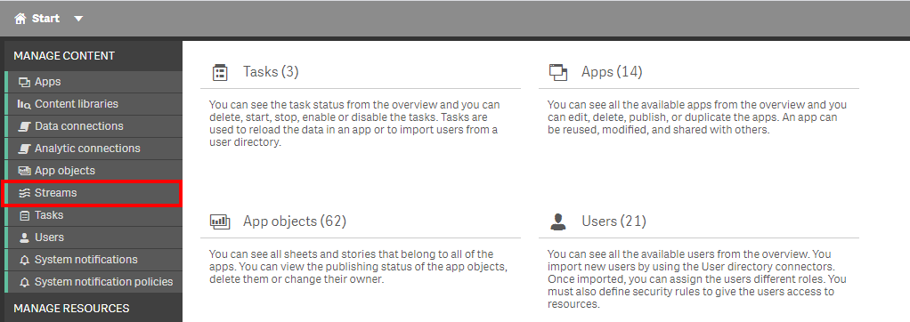
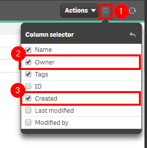
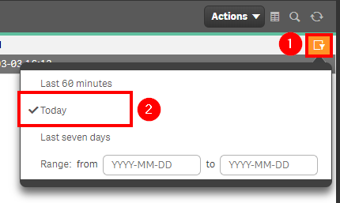

# Check for New Streams <i class="fas fa-dolly-flatbed fa-xs" title="Shipped | Native Capability"></i> <i class="fas fa-file-code fa-xs" title="API | Requires Script"></i>
{:.no_toc}

<span class="label dev">development</span><span class="label prod">production</span>

|                                  		                    | Initial   | Recurring  |
|---------------------------------------------------------|-----------|------------|
| <i class="far fa-clock fa-sm"></i> **Estimated Time**   | 2 min     | 2 min     |

Benefits:

  - Increase awareness
  - Increase reaction times
  
-------------------------

## Goal
{:.no_toc}
Checking for new streams and ensuring that stream governance is tightly controlled is an important aspect of Qlik management. If streams are being created regularly, it is a potential sign that the way assets are organized might not be optimal, or potentially that users/LOBs' are trying to go around a certain process. Ideally, very few individuals should have the right to create streams, so it is an important thing to keep an eye on to ensure nothing is out of the ordinary.

## Table of Contents
{:.no_toc}

* TOC
{:toc}
-------------------------

## QMC - Streams <i class="fas fa-dolly-flatbed fa-xs" title="Shipped | Native Capability"></i>

In the QMC, select **Streams**:

[](https://raw.githubusercontent.com/qs-admin-guide/qs-admin-guide/master/docs/asset_management/streams/images/check_new_streams_native_1.png)

In the upper right hand side of the screen, select the **Column selector**, and then select the **Owner** and **Created** columns.

[](https://raw.githubusercontent.com/qs-admin-guide/qs-admin-guide/master/docs/asset_management/streams/images/check_new_streams_native_2.png)

Now select the filter icon for the **Created** column, and then select the filter of **Today** (or **Last seven days** if you'd like a slightly larger rolling window).

[](https://raw.githubusercontent.com/qs-admin-guide/qs-admin-guide/master/docs/asset_management/streams/images/check_new_streams_native_3.png)

Lastly, you can review the resulting table and view any new streams.

[](https://raw.githubusercontent.com/qs-admin-guide/qs-admin-guide/master/docs/asset_management/streams/images/check_new_streams_native_4.png)

-------------------------

## Get List of New Streams (Qlik CLI) <i class="fas fa-file-code fa-xs" title="API | Requires Script"></i>

The below script snippet requires the [Qlik CLI](../../tooling/qlik_cli.md).

The script will bring back any streams with a **Created Date** that is greater than or equal to x days old. The script will then store the output into the location of your choice in either csv or json format.

### Script
```powershell
# Function to collect streams that were created in the last x days

# Parameters
# Assumes default credentials are used for the Qlik CLI Connection
$computerName = 'machineName'
$virtualProxyPrefix = '/default' # leave empty if windows auth is on default VP
$daysBack = 1
$filePath = 'C:\'
$fileName = 'output'
$outputFormat = 'json'

$outFile = ($filePath + $fileName + '.' + $outputFormat)
$date = (Get-Date -date $(Get-Date).AddDays(-$daysBack) -UFormat '+%Y-%m-%dT%H:%M:%S.000Z').ToString()
$computerNameFull = ($computerName + $virtualProxyPrefix).ToString()

# Main
Connect-Qlik -ComputerName $computerNameFull -UseDefaultCredentials -TrustAllCerts

If ($outputFormat.ToLower() -eq 'csv') {
  Get-QlikStream -filter "createdDate ge '$date'" -full | ConvertTo-Csv -NoTypeInformation | Set-Content $outFile
  }  Else {
  Get-QlikStream -filter "createdDate ge '$date'" -full | ConvertTo-Json | Set-Content $outFile
}
```

### Example Output
```
{
    "id":  "b4062a80-bf90-48ad-9328-12c945743f1e",
    "createdDate":  "2020/03/03 21:13",
    "modifiedDate":  "2020/03/03 21:13",
    "modifiedByUserName":  "QLIK-POC\\dpi",
    "customProperties":  [

                         ],
    "owner":  {
                  "id":  "27a825fe-3cad-488a-9dcd-d436a90e319c",
                  "userId":  "dpi",
                  "userDirectory":  "QLIK-POC",
                  "name":  "dpi",
                  "privileges":  null
              },
    "name":  "Delete",
    "tags":  null,
    "privileges":  null,
    "schemaPath":  "Stream"
}
```

**Tags**

#weekly
