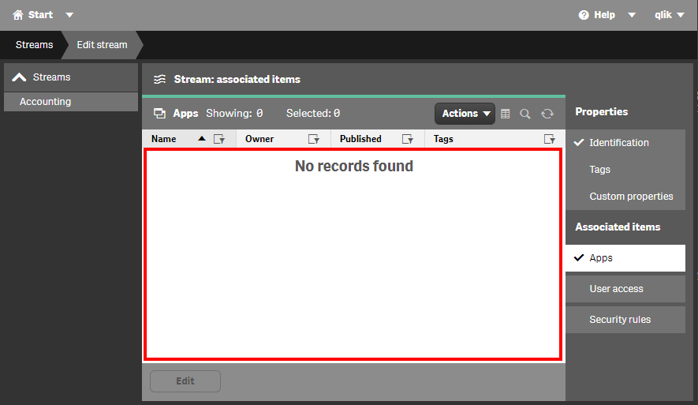

# Remove Unused Streams <i class="fas fa-dolly-flatbed fa-xs" title="Shipped | Native Capability"></i> <i class="fas fa-file-code fa-xs" title="API | Requires Script"></i>
{:.no_toc}

## Applicable Environments
{:.no_toc}
* All

## Goal
{:.no_toc}

There are several reasons why empty streams may be present in a Qlik environment. Sometimes, applications are moved from one stream to another and the admin doesn't notice that the former stream is now empty. Other times, streams are created in anticipation of new applications being published to them, yet none ever actually get published. It is always a good practice to periodically check on the validity of the streams and to remove those that are deemed unnecessary.

## Table of Contents
{:.no_toc}

* TOC
{:toc}

-------------------------

## QMC - Manually Check Published Apps For Each Stream  <i class="fas fa-dolly-flatbed fa-xs" title="Shipped | Native Capability"></i>

In the QMC, select **Streams**:

[](https://raw.githubusercontent.com/qs-admin-guide/qs-admin-guide/master/docs/asset_management/streams/images/remove_unused_stream_01.png)

To view all applications that were published to a specific stream, select the stream name and enter into edit mode.

[](https://raw.githubusercontent.com/qs-admin-guide/qs-admin-guide/master/docs/asset_management/streams/images/remove_unused_stream_02.png)

In **Edit** mode, select the **Apps** tab.

[](https://raw.githubusercontent.com/qs-admin-guide/qs-admin-guide/master/docs/asset_management/streams/images/remove_unused_stream_03.png)

Applications that were published to this stream will now be visible.

[](https://raw.githubusercontent.com/qs-admin-guide/qs-admin-guide/master/docs/asset_management/streams/images/remove_unused_stream_04.png)

This process should be repeated for each **Stream** to find unused streams.
If there is a considerable quantity of streams, consider the [Qlik CLI method](#get-list-of-unused-streams-qlik-cli-).

-------------------------

## Get List of Unused Streams (Qlik CLI) <i class="fas fa-file-code fa-xs" title="API | Requires Script"></i>

The below script snippet requires the [Qlik CLI](../../tooling/qlik_cli.md).

### Script
```powershell
# Script to find any empty streams

# Parameters
# Assumes default credentials are used for the Qlik CLI Connection
$computerName = 'machineName'
$virtualProxyPrefix = '/default' # leave empty if windows auth is on default VP
$filePath = 'C:\'
$fileName = 'output'
$outputFormat = 'json'

$outFile = ($filePath + $fileName + '.' + $outputFormat)
$computerNameFull = ($computerName + $virtualProxyPrefix).ToString()

# Main
Connect-Qlik -ComputerName $computerNameFull -UseDefaultCredentials -TrustAllCerts
$streamJson = Get-QlikStream -raw -full
$appStreamIds = Get-QlikApp -filter "published eq true" | foreach{$_.stream.id} | Sort-Object | Get-Unique
$emptyStreamIDs = ($streamJson | foreach{$_.id}) | ?{$appStreamIds -notcontains $_}
$streamEmptyJson = $streamJson | ?{$emptyStreamIDs -contains $_.id}

(&{If($emptyStreamIDs.count) {$("Empty Streams Found: " + $emptyStreamIDs.count) ; $streamEmptyJson} Else {"No Empty Streams Found"}})
If ($emptyStreamIDs.count) {
    (&{If($outputFormat.ToLower() -eq 'csv') {$streamEmptyJson | ConvertTo-Csv -NoTypeInformation | Set-Content $outFile} Else {$streamEmptyJson | ConvertTo-Json | Set-Content $outFile}})
}
```

### Example Output
```
[
    {
        "id":  "b4062a80-bf90-48ad-9328-12c945743f1e",
        "name":  "An Empty Stream",
        "privileges":  null
    },
    {
        "id":  "450e940c-13cd-48b7-bc19-2b1f51c8da22",
        "name":  "Another Empty Stream",
        "privileges":  null
    }
]
```

**Tags**

#monthly
