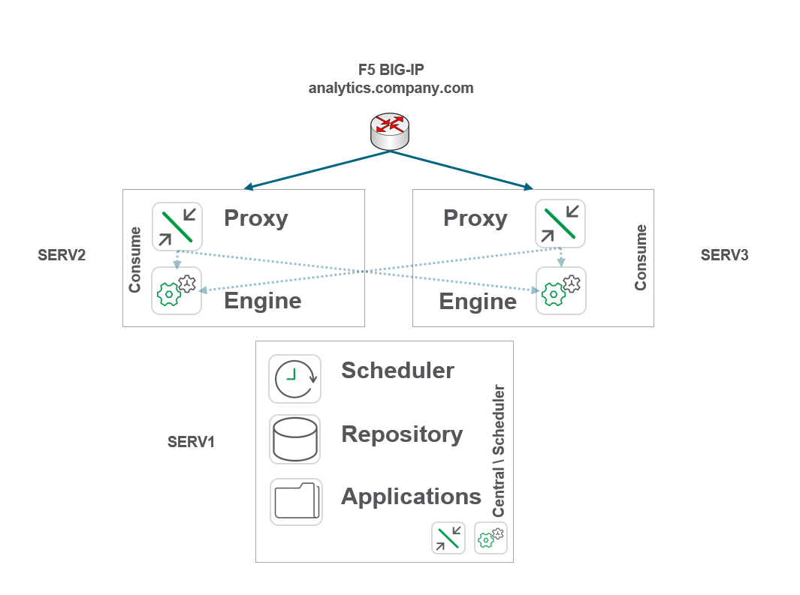
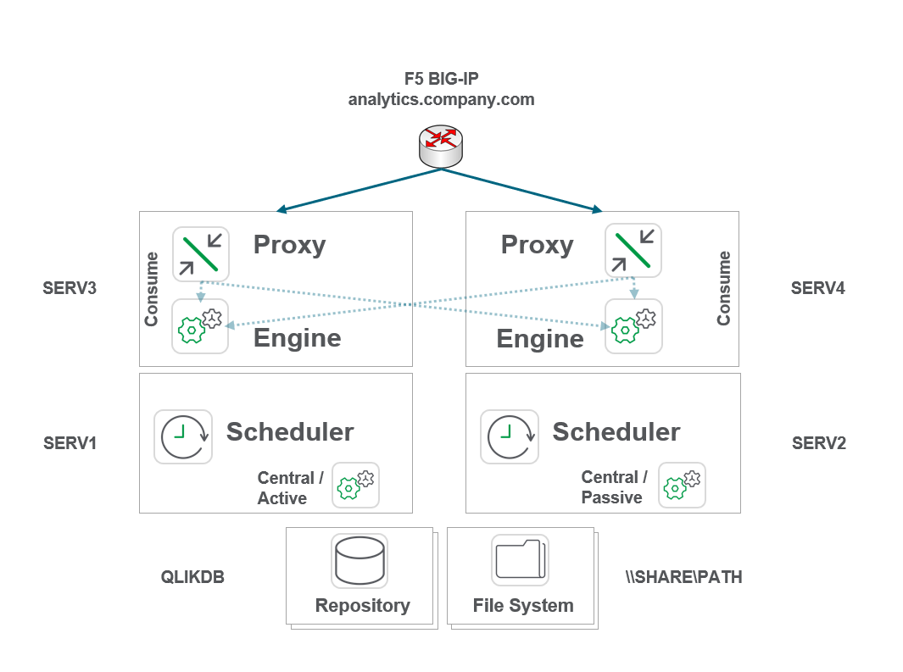
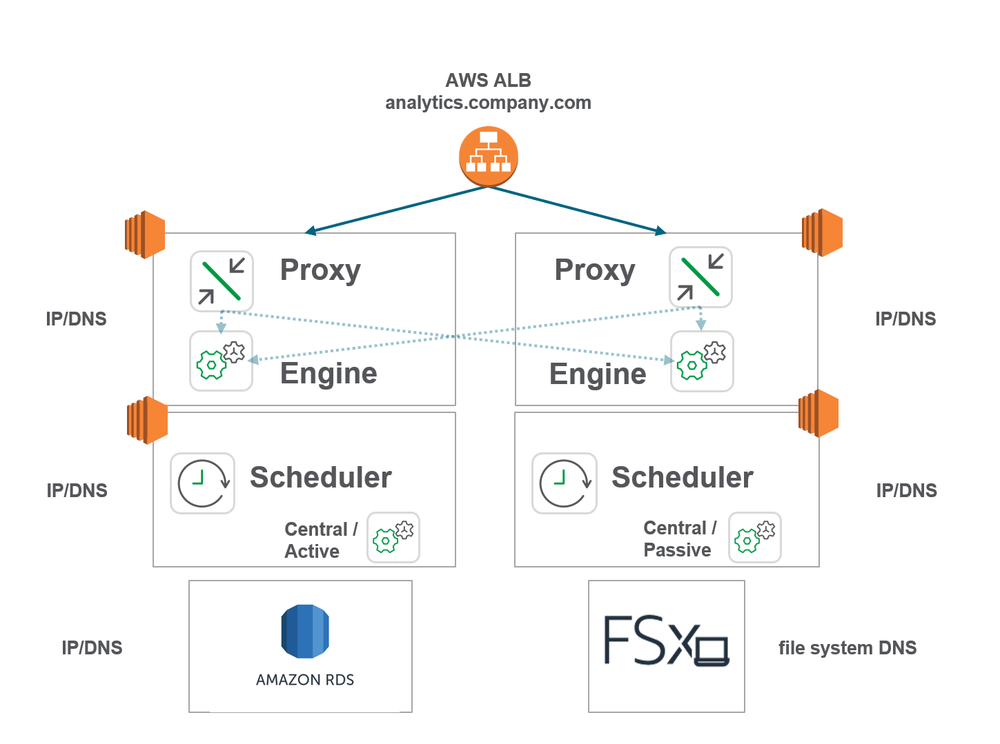

# Review Architecture/Scale Plan
{: .no_toc }

developmentproduction

|                                  		                    | Initial     | Recurring  |
|-----------------------------------------------------------|-------------|------------|
| <i class="far fa-clock fa-sm"></i> **Estimated Time**     | 2-3 hrs     | 1 hr       |

Benefits:

  - Provide documentation
  - Increase architectural knowledge
  - Plan for future deployments
  
-------------------------

## Goal
{:.no_toc}

The goal is to have documented Qlik architecture diagrams of n and n+1 deployments*, as well as an understanding of high-level architectural concepts within Qlik.

\* n refers to the current deployment, while n+1 refers to an anticpated state of the next deployment.

This is integral for:

- understanding the deployment and how it is laid out

- planning for growth

- articulating change

- understanding resiliency & availability

- having documentation available to others

-------------------------

## Table of Contents
{:.no_toc}

* TOC
{:toc}

-------------------------

## Supporting Documentation

Please take the time to review the below if unfamiliar before continuing on with this page.

*   ### [Architecture 101 (Components, Terminology)](review_architecture_scale_plan/architecture_101.md)
    {: .no_toc }
*   ### [Load Balancing Concepts](review_architecture_scale_plan/load_balancing_concepts.md)
    {: .no_toc }
*   ### [Resiliency & HA](review_architecture_scale_plan/resiliency_ha.md)
    {: .no_toc }
*   ### [Example Production Architectures](review_architecture_scale_plan/example_production_architectures.md)
    {: .no_toc }
    
-------------------------

## Building an Architecture Diagram

### Core Requirements
- An editor. This could be Visio, PowerPoint, or web editors like [Gliffy](https://gliffy.com) and [Draw.io](https://draw.io).

- A set of base icons or symbols

  - If the deployment is on-premises
  
    - a server
        
    - a database
        
    - a file share
        
    - a network load balancer
    
  - If the deployment is in the cloud:
  
    - AWS icons can be found [here](https://aws.amazon.com/architecture/icons/)
    
    - Azure icons can be found [here](https://www.microsoft.com/en-us/download/details.aspx?id=41937)
    
    - GCP icons can be found [here](https://cloud.google.com/icons)
    
- Knowledge of what Qlik services are active on what nodes

- Knowledge of what each Qlik node is being used for

- Knowledge of where the Qlik file share is and the Qlik respository database is

**Nice to Haves**

- Server names and aliases

- Any network load balancers/interfaces in front of Qlik

- Any firewall settings pertinent to Qlik

### On-Premsises Diagram Example

**Growth Environment**

**Enterprise Environment**

### AWS Diagram Example

**Enterprise Environment**

\* Please note that these cloud diagrams are intended for Qlik admins and occasionaly used to translate needs to supporting LOBs like IT. The examples below do not conform to the individual cloud vendor architectural diagram standards, as these aren't designed to be consumed by cloud engineers/network admins, etc. If one would like to include VPCs, AZs, SGs, Network ACLs, all the better -- however it goes beyond the basics of this exercise.

\* SMB file share – either FSx (requires domain) or EBS storage on EC2 instance.

\* One could also leverage the _Growth Environment_ in AWS, with both the repository database and fileshare on an AWS EC2 instance.

### Azure Diagram Example

**Enterprise Environment**

\* Please note that these cloud diagrams are intended for Qlik admins and occasionaly used to translate needs to supporting LOBs like IT. The examples below do not conform to the individual cloud vendor architectural diagram standards, as these aren't designed to be consumed by cloud engineers/network admins, etc. If one would like to include Virtual Networks, Subnets, Resource Groups, etc, all the better -- however it goes beyond the basics of this exercise.

\* Azure Files for SMB Storage with Cmdkey or Windows Credential Manager.

\* One could also leverage the _Growth Environment_ in Azure, with both the repository database and fileshare on an Azure VM.

-------------------------

## Planning for N+1 Architectures

In order to plan for an upcoming architectural event, it is imperative to have an understanding of the varying methods of scaling a site, as well an awareness of any architectural impacts the current [Capacity Plan](review_update_capacity_plan.md) might have.

### High-level Scaling Concepts

Broadly speaking, there are two primary scaling methodologies -- however, do note that these are not mutually exclusive:

1. Horizontal Scaling
  - Adding additional nodes/services, providing a wide, resilient topology.
  
2. Vertical Scaling
  - Expanding current server footprints, i.e. adding additional cores/RAM.

Horizontal scaling is typically common if a Qlik environment has small to medium sized applications with many users. Meaning, applications can be loaded quickly onto many different engines with little delay, and calculations are fast -- meaning that a shared cache isn't necessarily as integral for these applications. This methodology is also common in virtual environments on-premsises where VM sizes may be restricted. For instance, if an organization caps VM sizes at 96 or 128 GB of RAM, more than likely that Qlik environment will end up with a wider footprint, and will adopt practices to allow their applications to fit it.

Vertical scaling is typically common where the user base is not extensive, and the applications are quite large. Less nodes with larger capacity allows for larger applications with more users taking advantage of the same cache. These applications are usually [cache warmed](../tooling_appendix/cache_warming.md) so that they are readily available for users without delay.

Both of these methodologies are frequently combined when an organization has a mix of both very large apps and smaller apps with a wide user pool. It is usually common for organizations to have "small - medium app engines" and "large app engines" -- for example, maybe four of the former and two of the latter. Leveraging load balancing rules (as described above), large applications are "pinned" to the larger nodes, and vice versa.

### Review Capacity Plan

In order to plan for the next architectural event, one must first review the current [Capacity Plan](review_update_capacity_plan.md).

Common questions that would have impact:

1. Is there a significant license growth event that would mandate additional proxy/engine nodes?

2. In general across end-user engine nodes, are the CPU/RAM metrics in a healthy state consistently? If not, this might warrant the need for vertical growth or app optimization.

3. Are there intra-day reloads running on end-user nodes that are affecting performance, therefore the end-user experience? That could warrant offloading them to dedicated schedulers (this is highly encouraged and preferred).

4. Are there applications that are being considered for "application pinning" to specific engine nodes via load balancing rules? Could application optimization bring these applications down in size to avoid that, or are they simply monolithic by nature and need to be pinned? Are there enough engine nodes currently to support the segragation of assets while providing resliency (2+ nodes for each), or do more engine nodes need to be added. Is vertical growth required to support these large applications on less nodes, given the fact that there will be more user caching on less nodes potentially?

5. Is horizontal growth preferred, or is vertical growth preferred, or is there a business event driving one or the other? Is a mix of both possible? This will involve discussions with IT to see what is possible.

6. Is something outside the Qlik deployment driving an architectural event, e.g. there is money to be spent on infrastructure now, though a license event might not occur for another 6 months? This will involve speaking with the business to see what types of applications/use cases are in the pipeline to see what infrastructure should support future needs.

7. Is [ODAG](https://help.qlik.com/en-US/sense/Subsystems/Hub/Content/Sense_Hub/DataSource/Manage-big-data.htm) in play or going to be in play? Should these application reloads happen on a dedicated scheduler?

8. Is [Qlik NPrinting](https://help.qlik.com/en-US/nprinting/Content/NPrinting/Introduction/Introduction.htm) or [Qlik InsightBot](https://help.qlik.com/en-US/insight-bot/Content/QlikInsightBot/Home.htm) on the horizon or in play? Should these run against dedicated engines?

These are all questions that should be considered while planning for the next-state architecture.

-------------------------

