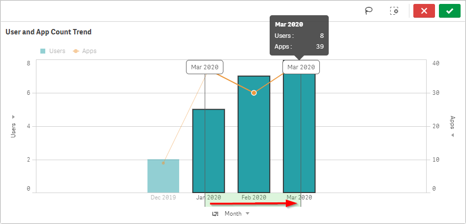
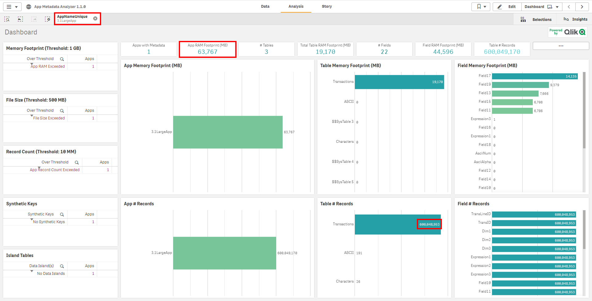
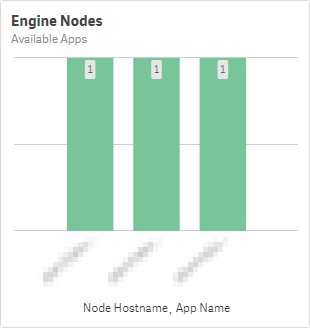

# Capacity Plan: Applications <i class="fas fa-dolly-flatbed fa-xs" title="Shipped | Native Capability"></i>
{:.no_toc}

## Applicable Environments
{:.no_toc}
- Prod

## Goal
{:.no_toc}

The goal of this exercise is to identify any applications that could be optimized or load balanced to dedicated engines.

There are a number of areas that should be focused on, including the following:

- Candidates for Application Pinning (Load Balancing)
- Candidates for Data Model Optimization

## Table of Contents
{:.no_toc}

* TOC
{:toc}

-------------------------

## Operations Monitor

Please refer to the [Operations Monitor](../../tooling/operations_monitor.md) page for an overview and relevant documentation links.

-------------------------

## App Metadata Analyzer

Please refer to the [App Metadata Analyzer](../../tooling/app_metadata_analyzer.md) page for an overview and relevant documentation links.

-------------------------

## Application Usage

### Confirm Operations Monitor is Operational

Navigate to the **Monitoring apps** stream and open up the **Operations Monitor** application.

First and foremost, it is essential to confirm that the **Operations Monitor** is operational and up to date. Ensure that it is by selecting the _Show app information_ button, and then viewing the _Data last loaded_ section of the application's description. Alternatively, one could also check the task status in the QMC.

If the application is not operational [this support article](https://support.qlik.com/articles/000024083) is a great place to start.

## Gather Top Applications by Usage

Select the _Session Overview_ sheet.

Select the last three months (assuming this exercise is executed quarterly) by selecting the **Month** field in the _User and App Count Trend_ chart.

Record the top applications by usage in the _Top 50 Apps_ chart.

## App Metadata Analyzer

For the next exercise, the [App Metadata Analyzer](../../tooling/app_metadata_analyzer.md) is required. Confirm that it is setup, and then navigate to the _Dashboard_ sheet.

Find the intersection of the highly used applications from the **Operations Monitor** with applications with high base RAM footprints. In the below, an application that is consistently leveraged has been selected that has a base RAM footprint of ~64 GB RAM. This application has ~600 M records.

Two steps need to occur here:

1. If there are mutliple end-user facing engines in the deployment, where is this application currently available? As it is quite large and heavily used, it might not make sense to have it available on all nodes. For example, if there are more than two end-user nodes, it would be worth considering "pinning" this application to a minimum of two nodes for resiliency--allowing the other nodes to not be overloaded, and by increasing the caching of the applications to less nodes, improving response times.

2. Is there an optimization event? It can be noted in the _Field Memory Footprint (MB)_ table that **Field17** consumes ~14 GB RAM. Is that field necessary, can it be optimized? For instance, is it a timestamp that can be floored, or a field that can otherwise be broken apart to reduce cardinality? Other areas of interest include: total number of fields in an application, total number of records in an application and/or table, presence of synthetic keys, presence of data islands, etc.

Step 1 can quickly be validated by navigating to the _App Availability_ sheet, while that application remains selected.

Here, it can easily be seen that out of the three available engine nodes, the application is available on all of them.

## Example Takeaway

| Candidates for "App Pinning" | Candidates for Data Model Optimization |
|------------------------------|----------------------------------------|
| 2                            | 3                                      |
