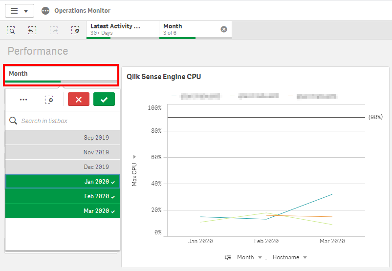
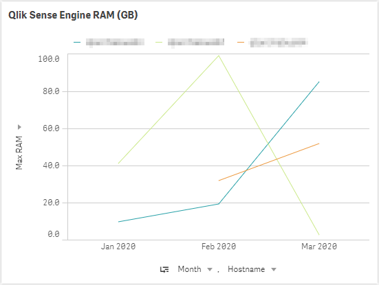

# Capacity Plan: System <i class="fas fa-dolly-flatbed fa-xs" title="Shipped | Native Capability"></i>
{:.no_toc}

## Applicable Environments
{:.no_toc}
- Prod

# Goal
{:.no_toc}

The goal of this exercise is to identify any potential system concerns across your production site. The **Operations Monitor** application exposes this information simply, so that it can be easily referenced.

There are a number of metrics that should be focused on, including the following:

- Engine CPU
- Engine RAM
- Users per Engine
- Batch Window
- Intra-day Reloads

\* Note that more important than any of the above is the overall end-user experience. If the end-users are complaining about performance issues, even though the above metrics look to be good, it could likely be due to the application itself. Refer to: [Applications](applications.md).

## Table of Contents
{:.no_toc}

* TOC
{:toc}

-------------------------

## Operations Monitor

Please refer to the [Operations Monitor](../../tooling/operations_monitor.md) page for an overview and relevant documentation links.

-------------------------

## System

### Confirm Operations Monitor is Operational

Navigate to the **Monitoring apps** stream and open up the **Operations Monitor** application.

First and foremost, it is essential to confirm that the **Operations Monitor** is operational and up to date. Ensure that it is by selecting the _Show app information_ button, and then viewing the _Data last loaded_ section of the application's description. Alternatively, one could also check the task status in the QMC.

### Gather Metrics

Select the _Performance_ sheet.

Select the **Month** field and select the last three months, assuming this exercise is being executed quarterly.

Now, focus on the _Qlik Sense Engine CPU_ chart for a moment. Ensure that the measure is set to _Max CPU_. Note that this chart defaults to viewing at the _Month_, however it can drill down to the day, hour, and ten-minute timeline. It is advised to look for extended durations of high CPU utilization, and to see if those events are recurring. In the below chart, we can see that these servers are not heavily utilized, as the maximum CPU does not go above 32%.

Next, focuse on the _Qlik Sense Engine RAM (GB)_ chart. This chart is of the same construct as the prior, except focusing on RAM utilization. It is important to note that this chart is showing not only the "base RAM footprint" of the applications, but also the "result set cache RAM", as well as RAM for calculations, etc. Take the time to review the chart below and look for extended periods of time of very high RAM utilization, say around 90%, where the server is continuously fighting to clear cache to make room for new result sets. It should be relatively clear if the server is over-taxed if it is flat-lining consistently. The servers in the chart below look healthy, however.

As there is no simple way here to show what applications are consuming what percentage of that RAM total, a way to draw a line in the sand could be the following best practice:

- *The total base RAM footprint of all applications available to be lifted onto the engine should be <= 40% of the total RAM of the server.

\* Of course, this is a best practice from keeping a server from going off the rails, but it is not guaranteed. If there were thousands of users hitting that box at the same time, they would more than likely consume more than the available amount of RAM left over--but in general, it is a good practice if users have been properly distributed across engines.

To gather this metric, we need to leverage the [App Metadata Analyzer](../../tooling/app_metadata_analyzer.md). Confirm that it is setup, and then navigate to the _App Availability_ sheet.

In the _Engine Node: Available Apps & Base RAM Footprint_ table, one can view the total base RAM footprint for all applications that are able to be lifted on each individual engine node. 

Here, it is visible that all apps are available on all engine nodes--meaning there are no custom load balancing rules in place. The total application RAM footprint is 155 GB, and in this case, the servers have a total of 512 GB of RAM. This puts the total base RAM footprint at 30% of the total server RAM--which is below that 40% line from the best practice above--so all is well for the time being.

