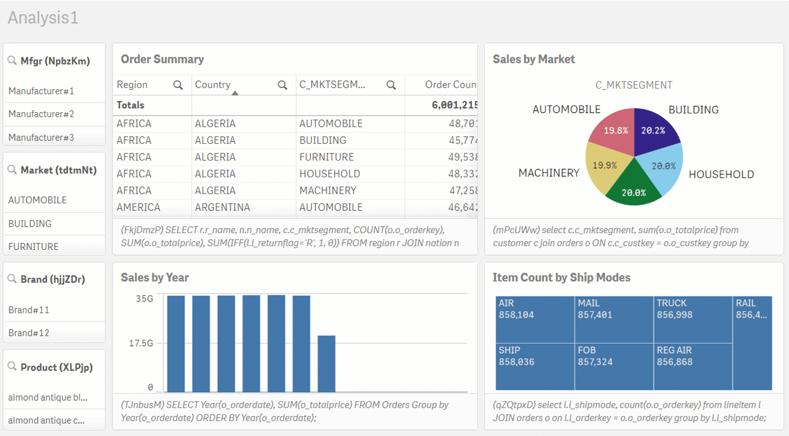
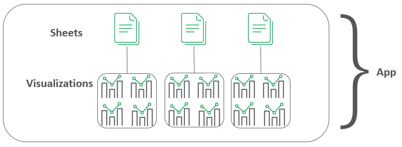

# Telemetry Dashboard <i class="fas fa-tools fa-xs" title="Tooling | Pre-Built Solutions"></i>
{: .no_toc }

## Applicable Environments
{:.no_toc}
- All Tiers

## Table of Contents
{:.no_toc}

* TOC
{:toc}

## About

The Qlik Sense Telemetry Dashboard is a project created and maintained by the Enterprise Architecture team in Qlik's Americas Presales organization. It leverages additional logging which can be enabled in [Qlik Sense Enterprise February 2018 and newer](https://support.qlik.com/articles/000044757) releases of Qlik Sense with some data enrichment with API calls to provide visualization-level performance data for Qlik apps. The goal of the tool is to present this performance data in actionable ways for administrators / developers to have precision when focusing on performance improvements for Qlik apps.

### What is Telemetry in Qlik Sense Enterprise?

Telemetry in Qlik Sense Enterprise is essentially:

1. a threshold based logging. for 
2. Qlik Engine requests

(1) makes Telemetry different than traditional application logs. ERRORs or WARNs in Telemetry are based on the thresholds the administrator sets.

(2) refers to the fact that the Qlik Engine treats requests differently than what a user might expect. Engine requests can refer to obvious things like opening an app (`OpenApp` method) or reloading an app (`DoReload` or `DoReloadEx` methods). Those are straight-forward. Less intuitive is that when inside of a Qlik app, each visualization on a sheet is a separate request to the Engine. In this example we are high-lighting the 8 different requests (`GetLayout` method) which are made when opening our example sheet:

[](https://raw.githubusercontent.com/qs-admin-guide/qs-admin-guide/master/docs/tooling/images/telemetry-1.gif)

When a request breaches the configured threshold, the individual request will be logged. In the example above, if the filter pane in the upper left hand corner breaches the threshold, the log file will record the request for just that object (e.g. a `GetLayout` call for object `NpbzKm`).

The key pieces of information that are logged when a request breaches the threshold that are used in the associated Qlik are include:

| Field                     | Explanation |
| -------------             | -------------      |
| `Timestamp`               | Time of the breached threshold           |
| `Level`                   | Level of the breach (ERROR vs. WARN)           |
| `ActiveUserId`            | UserId of the user who was making the request         |
| `ActiveUserDirectory`     | UserDirectory of the user who was making the request           |
| `Method`                  | Engine API method of the request(e.g. `GetLayout`, `OpenApp`, `DoReload`)           |
| `DocId`                   | AppID where the request occurred          |
| `ObjectId`                | ObjectId of the object requested           |
| `ObjectType`              | The type of object requested, if relevant |
| `ProcessTime`             | How long did this request take to be completed?           |
| `NetRAM`                  | How much RAM did the request take           |

This is the extent of the product level changes which were first implemented in Qlik Sense Enterprise February 2018.

In order to increase the consumability and provide context for these logs, the Enterprise Architecture Team has created a project to surface this data in context and in a Qlik app.

### Overview of the project

The Qlik Sense Telemetry Dashboard project provides an installer which installs a couple of things which will be used in presenting the data in a consumable fashion:

1. It installs NodeJS scripts which build out meta-data about apps
2. It configures data connections used by the Qlik app
3. It imports the Qlik App
4. It configures chained tasks which (a) rebuild the meta-data and (b) reload the Qlik app

(1) is needed to build out the hierarchical relationship between visualization objects, the sheets in which the visualizations live, and the apps which hold those sheets.

[](https://raw.githubusercontent.com/qs-admin-guide/qs-admin-guide/master/docs/tooling/images/telemetry-2.png)

This hierarchy allows for the consumer of the Telemetry Dashboard Qlik app to place the request in context. Moreover, with this context, specific feedback can be made to the developer(s) of this app to focus their optimization efforts on the offending visualization(s) rather than providing much more generic feedback that 'the app is slow'.

Since the project needs these NodeJS scripts to build the hierarchy of app <> sheets <> visualizations, the installer configures an [External Program Task](https://help.qlik.com/en-US/sense-developer/Subsystems/RepositoryServiceAPI/Content/Sense_RepositoryServiceAPI/RepositoryServiceAPI-External-Program-Task-Create.htm) which runs the NodeJS scripts as a Qlik task. This External Program Task is chained so that its successful execution reloads the Qlik app which depends on output from the External Program Task.

### Considerations on setting thresholds

As covered above, this feature in Qlik Sense Enterprise requires the administrator to set the thresholds which register as ERRORs or WARNs. Making the configuration change is covered on the [project's wiki](https://github.com/eapowertools/qs-telemetry-dashboard/wiki/Logging). We will cover what _values_ are appropriate to be set. A common set of configs are:

```
ErrorPeakMemory=2147483648
WarningPeakMemory=1073741824
ErrorProcessTimeMs=60000
WarningProcessTimeMs=30000
```

This means that any request which uses over 2GB (`2147483648/1024/1024/1024`) will be logged as an ERROR in the log. Requests over 1GB will be logged as a WARN. Likewise, any request which takes over 60s (`60000/1000`) will be logged an ERROR and those taking over 30s will be logged as a WARN.

These settings are generally appropriate for most environments.

As a rule, the `Error` and `Warning` values for `PeakMemory` and `ProcessTimeMs` should have enough of a gap to cover a steady increase of the underlying values. For example, using `ProcessTimeMs`, setting the `Error` value to 60s and `Warning` value to 59 seconds would not provide enough delta between `Error` and `Warning` to determine whether a particular `Error` event was due to a steady increase of the underlying data (as is expected for many Qlik apps) or due to a one-off event. Providing a healthy gap between the `Warning` and `Error` values will allow the Qlik administrator and the BI Developers a directional sense of changes over time.

For **Production** environments, the `Warning` thresholds, especially the `ProcessTimeMs` value, should be set at a level where the response time is slow enough to at least register. The `Error` thresholds should be set at a level where relatively quick attention by the administrator and/or developers is needed.

### Using the app for analysis

Once the Telemetry logging is configured, the server has run for a few days to build out a historical record of the requests that breached the configured thresholds, and the Telemetry Dashboard has been installed + reloaded, the administrator and/or developers should review the app for anomalies.

`<more stuff to be added later>`

## Documentation:

- [Qlik Sense Telemetry Dashboard Project](https://github.com/eapowertools/qs-telemetry-dashboard)
- [Youtube Video - Initial Configuration](https://www.youtube.com/watch?v=dfkoc4Dwb0g&feature=youtu.be)
- [Youtube Video - Installation](https://www.youtube.com/watch?v=EPLl1BODwH4&feature=youtu.be)
- [Youtube Video - App Config](https://www.youtube.com/watch?v=iLKOpnKbLJg&feature=youtu.be)
- [Youtube Video - Analysis](https://www.youtube.com/watch?v=2BfZDxODhzE&feature=youtu.be)

**Tags**

#tooling
